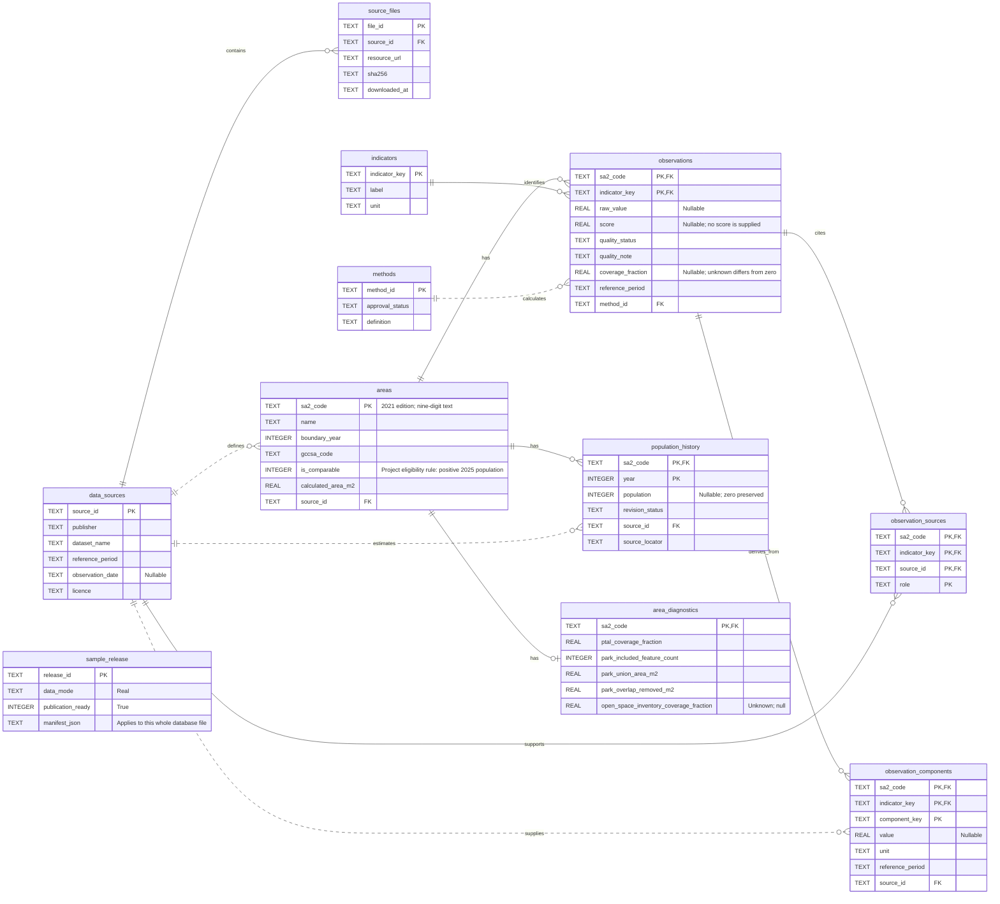

# ER diagram and schema design notes

This diagram reflects the delivered [SQLite database](yfn.sqlite), not an unimplemented target. It shows selected columns; the [column dictionary](data-dictionary.md) and [SQL DDL](../../pipeline/greater_melbourne_schema.sql) contain the full schema. The editable source is [schema-erd.mmd](schema-erd.mmd).

## Reading the relationships

An area has four observations in this release and six population-history rows. The SQL schema allows any number; the builder validates the required four/six cardinalities. Each observation is uniquely identified by `(sa2_code, indicator_key)`.

An observation can use multiple sources. `observation_sources` joins it to each dataset and records a role such as numerator, denominator or boundary. `observation_components` retains the actual inputs and their periods. For open space, the inventory area and 2025 population are separate components from different sources.

One dataset can have many downloaded files. `source_files` records exact API requests, checksums and retrieval dates, while `data_sources` stores shared meaning and limitations. Intersection audit rows identify source feature IDs and their exact raw file; those large audits and geometry are kept outside the runtime database.

Solid identifying relationships indicate a parent key forms part of a child's primary key; dotted relationships are other foreign keys. Mandatory parent references use `||`; SQL permits zero or more children unless an additional constraint says otherwise. The single diagnostics row per area is enforced by its primary key. The builder supplies one for every area.

`sample_release` describes the whole database file and has no row-level foreign key to the other tables. This is deliberate for one release per file. Do not add a fictitious relationship to the diagram.

## Design decisions supported by the real data

1. **Retain geography independently of indicator availability.** Two SA2s have zero residents. Keep them for traceability while the project eligibility rule excludes them from comparisons that require per-resident measures.
2. **Separate raw input tokens from display values.** Three source rent zeros become unavailable medians; original tokens remain in the audit. Zero population remains a genuine integer zero.
3. **Keep coverage independent of value and quality.** A numeric PTAL average can cover less than 1% of an SA2. Open-space inventory completeness is unknown even when a polygon is present. Both need explicit handling.
4. **Store numerator and denominator.** Large public-open-space ratios can reflect a tiny resident population. The denominator must be inspectable, not hidden behind a rounded ratio.
5. **Version methods and dates.** A 2021 rent, a 2020–2025 population change and an undated inventory must not share a fabricated single observation date. A transport raw index and its future percentile are separate fields.

## Boundaries of this schema example

The database stores one boundary edition and one current observation per area/indicator per release. For multiple boundary editions or observation releases in one database, extend the primary and foreign keys consistently (for example with a geography-edition identity and release ID). Do not merely add a year column while keeping an incompatible unique key.

The release metadata records real data that the team has approved for publication (`publication_ready=1`). `is_comparable` currently means positive 2025 ERP and does not approve transport scoring eligibility or a minimum population threshold. Source quality cannot be fixed by a database constraint.

No suburb-alias table is populated because a verified one-to-many suburb/SA2 mapping has not been acquired. The diagram does not invent one. The application can begin with official SA2 names, and a future alias relationship can be added with its own source and mapping basis.
